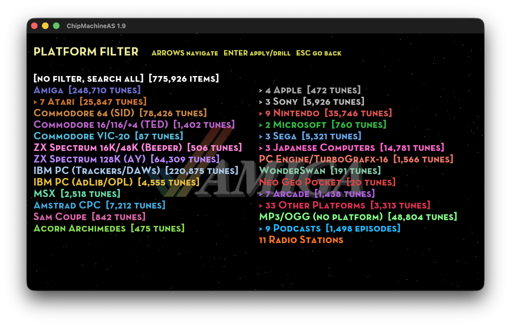
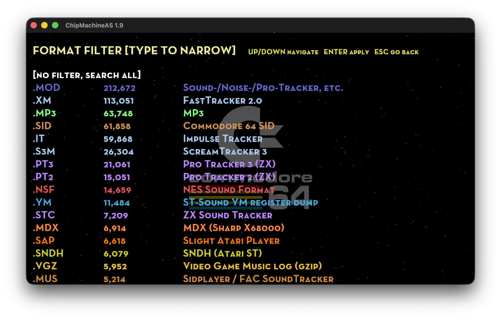
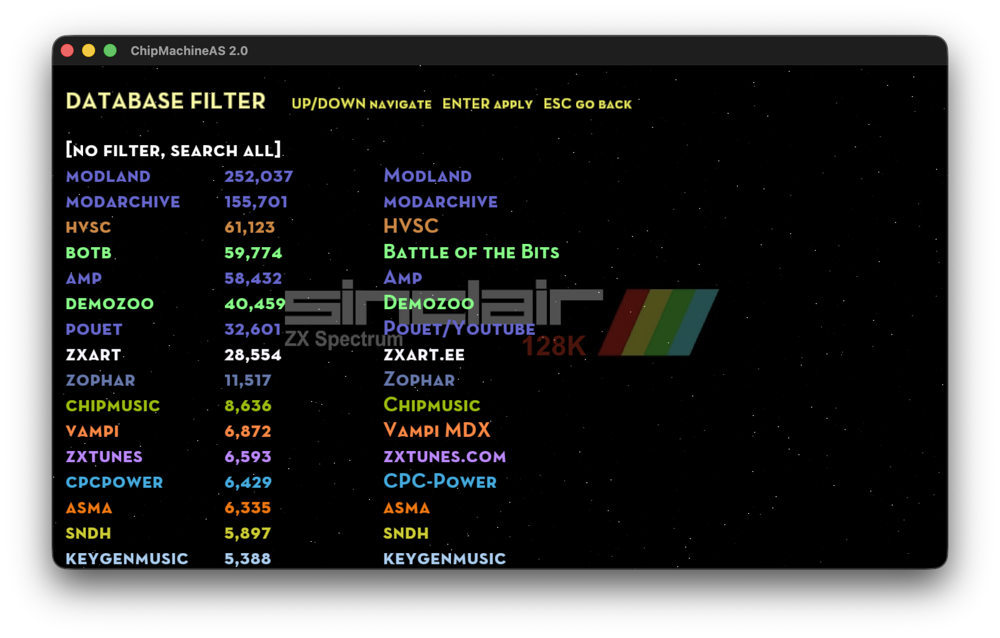
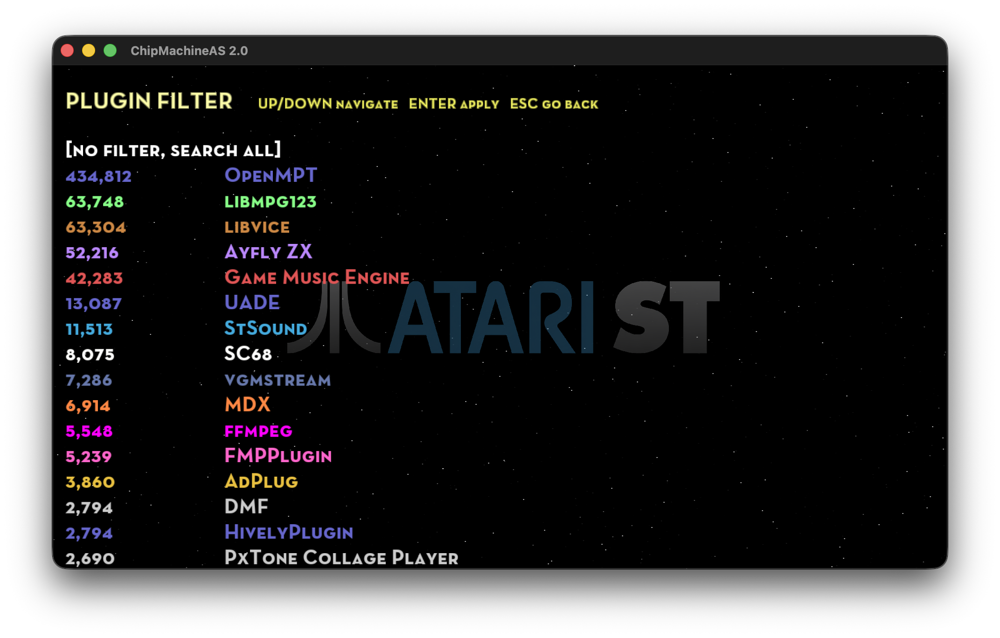

**ChipMachineAS**

<div align="right">
  
</div>

**Port of ChipMachine for Apple Silicon**

But this is far more than a simple port!

While ensuring the player runs on modern Apple hardware, my passion for it has expanded its compatibility and scale:

* [60+ plugins](https://github.com/mihailod/chipmachine/tree/master/external/musicplayer/src/plugins) supporting [350+ music formats](data/misc/formats_descriptions.txt)
* [~770,000](data) indexed songs (~100,000 annotaded with screenshots) and counting

**The mission statement: support every single format and index all retro/chip music databases.**

Despite the massive expansion under the hood, the core experience remains untouched: instant, incremental autocomplete search across the entire global library, delivering instant zero-latency (for cached songs) playback from a single, simple, unified interface.

**(Screenshots might show features from dev in progress (not released) code.)**
[](https://youtu.be/WsNhwxY1c08)
[](https://youtu.be/WsNhwxY1c08)
[](https://youtu.be/WsNhwxY1c08)
[](https://youtu.be/WsNhwxY1c08)
[](https://youtu.be/WsNhwxY1c08)
[](https://youtu.be/WsNhwxY1c08)

## Intro

*A demoscene/retro Jukebox/spotify-like music player*

* **Simply start typing for incremental auto-complete search of the aggregated database**
* **UP/DOWN keys = select a song from search results**
* **ENTER key = play**
* **TAB key = help screen**
* **(Read the scrolling text for more info)**
* **[Things in progress / to come](data/misc/TOODOO.txt)**
* **Ultimate goal: every chiptune ever made searchable and instantly playable!** 

## Binaries

Binaries for macOS (tested on Tahoe) are available under [*Releases*](https://github.com/mihailod/chipmachine/releases)

**NOTE although not formally tested, ChipMachineAS should work on pre-Tahoe macOS**

### Running on Mac (Gatekeeper Authorization)

For now, the app is distributed with an ad-hoc code signature and macOS Gatekeeper will block it (official Mac App Store release coming soon).

This is standard behavior for open-source binaries distributed outside the official Mac App Store ecosystem.

To authorize and run the application on your Mac, follow these steps:

1. Download the latest release and unzip it in the Applications folder
2. Double-click `ChipMachineAS.app`.
3. macOS will display a prompt stating the app cannot be opened because the developer cannot be verified.
4. Click **Done** or **Cancel**.
5. Open your Mac's **System Settings**.
6. Navigate to **Privacy & Security** in the left sidebar
7. Scroll down to the **Security** section.
8. Look for the notification stating: `“ChipMachineAS” was blocked from use because it is not from an identified developer.`
9. Click the **Open Anyway** button.
10. Authenticate using your Mac's admin password or Touch ID.
11. Double-click `ChipMachineAS.app` again.
12. The final confirmation prompt will appear.
13. Click **Open**.

*Note: You only need to perform this authorization once per release. Subsequent launches will boot instantly.*

### Opening local music files

Once installed, ChipMachineAS registers with macOS as a player for the hundreds of formats it supports, and you can open a local song three ways:

* **Right-click a file → Open With → ChipMachineAS** (or double-click a file you've made it the default for)
* **Drag and drop a file onto the ChipMachineAS icon** (Dock or Finder)
* **Drag and drop a file straight into the running ChipMachineAS window**

All three play the track immediately.

This is deliberately polite — ChipMachineAS advertises itself as an *alternate* handler and never hijacks files from a player you already use:

* For common audio types (`.mp3`, `.wav`, `.flac`, …) it appears as an option in **Open With** but never becomes the default unless you explicitly choose it via **Get Info → Open with → Change All**.
* For obscure chip/tracker formats that nothing else on your Mac opens, it becomes the de-facto player and shows its own document icon in Finder.

## Prerequisites for development (Tested on macOS 26 / Tahoe only)

* Make sure you have Homebrew installed (Apple Silicon homebrew in /opt/homebrew/ , make sure you are not using Intel legacy /usr/local tools)
* brew install git cmake ninja freetype glew glfw3 lua fftw mpg123 python ffmpeg boost
* (if some packages are reported missing later install then via brew and let me know -- I missed them in the line above!)

## Building for Apple Silicon

All third-party dependencies are **vendored inside the repo** under [external/](external/), so a single clone is all you need. Provenance (each vendored fork's upstream URL and commit) is recorded in [external/VENDORED.md](external/VENDORED.md).

```bash
git clone https://github.com/mihailod/chipmachine.git
mkdir build && cd build
cmake ../chipmachine -GNinja -DCMAKE_BUILD_TYPE=Release
ninja
```

* Running the app (from the build folder): ./chipmachine (-h for all options)
* Running the tests (from the build folder): ./cmtest
* Packaging the app: [package_app.sh](package_app.sh) — rebuilds the `chipmachine` target (incremental), bundles the runtime assets, generates the `Info.plist` with file associations, code-signs and zips the `.app`.
* AI tools used to help with the porting: Claude, Gemini, Antigravity, Codex

### macOS file associations (developer notes)

The `.app` advertises the formats it can play as macOS file associations (see the [user-facing note above](#opening-local-music-files)). All the platform-native macOS glue lives under [src/macnative/](src/macnative/):

* **`gen_info_plist.sh`** — the single source of the bundle's `Info.plist`. It builds the file-association document types from three inputs: `extensions.txt` (the full playable-extension union, dumped from the built binary via `chipmachine --dump-extensions`), `MacOSSystemTypeExtensions.txt` (formats with an existing system UTI — referenced politely at `LSHandlerRank=Alternate`, never redefined) and `MacOSHandlerDenyList.txt` (non-extension junk / dangerous tokens to drop). Everything else is exported under one umbrella UTI (`org.mihailod.chipmachineas.chiptune`) with the app's document icon. The last two `.txt` files are hand-editable.
* **`FileOpenHandler.mm`** — patches GLFW's app delegate (`GLFWApplicationDelegate`) at runtime to implement `application:openURLs:`, so double-click / "Open With" / icon drag-and-drop actually play the file (Finder does **not** pass files on `argv`, and this must win the race against GLFW's own `[NSApp run]` inside `glfwInit()`). Dropping a file into the running window instead goes through GLFW's native `glfwSetDropCallback` (wired in the vendored `external/apone/mods/grappix`) — cross-platform, no Apple Event involved. Both paths feed the same play queue.
* **`dev_update_doctypes.sh`** — fast, no-recompile test loop: rewrites the `Info.plist` in an existing bundle, re-signs it and re-registers it with LaunchServices in a couple of seconds. Pass `--with-binary` to also swap in the freshly-built executable and test double-click playback end-to-end. Run with `--help` for full usage.

`package_app.sh` invokes the generator automatically, so a normal release needs no extra steps.

## Using the application

* Type words separated by spaces for incremental search
* *ENTER* to play, *SHIFT-ENTER* to enque
* *F1* = Player screen, *F2* = Search screen
* *F5* = Play/Pause
* *F9* = Advanced search: set/reset search filter by platform (ie. Amiga)
* *F6* = Next Song (or *ENTER* from Player Screen)
* *ESC* = Clear search field
* *SHIFT-ESC* = Quit
* *F7* = Toggle Favorite
* Type _shoutcast_ to see the radio-stations
* [Things in progress / to come](data/misc/TOODOO.txt)

## Data Sources

### Chip Music Collections

Metadata from these databases is ingested, normalized, deduped and cross-checked for screenshots.

* Modland - https://ftp.modland.com
* High Voltage SID collection - https://www.hvsc.c64.org
* Gamebase64 - http://www.gb64.com
* AMP (Amiga Music Preservation) - http://amp.dascene.net
* RKO - http://remix.kwed.org
* Atari ST (SNDH) - http://sndh.atari.org
* SNES Music - http://snesmusic.org
* Atari SAP (ASMA) - http://asma.atari.org
* HVTC (High Voltage TED Collection) - http://plus4world.powweb.com
* NSFE (Famicompo mini NSFE archive of 1,228 songs from https://forums.nesdev.org/viewtopic.php?t=21128)
* Mod Archive - https://modarchive.org
* Bitworld - http://janeway.exotica.org.uk
* Exotica - https://www.exotica.org.uk
* CSDb - https://csdb.dk
* ZX Art - https://zxart.ee/eng/music
* CPC-Power - https://www.cpc-power.com
* Zophar's Domain - https://www.zophar.net
* Vampi's MDX Collection (Sharp X68000) - https://mdx.vampi.tech
* Demozoo - https://demozoo.org
* Scene.org - https://scene.org
* OPL Archive - https://opl.wafflenet.com
* Bulba's ZX Spectrum & Amstrad CPC AY/YM Music Archives - https://bulba.untergrund.net/music_e.htm
* VGMRips - https://vgmrips.net
* ZX TUNES - https://zxtunes.com
* SMS POWER! - https://www.smspower.org
* MirSoft - http://www.mirsoft.info
* Chipmusic - https://chipmusic.org
* Battle of the Bits - https://battleofthebits.org
* keygenmusic (Internet Archive) - https://archive.org/details/keygen-music-2020-03-pack

### Remixes / Recordings / Streaming (mp2/mp3/ogg/flac/wav/aif/aiff/opus)

* Pouët.net - https://www.pouet.net
* Amiga Remix (MP3) - http://amigaremix.com
* OverClocked ReMix (MP3) - https://ocremix.org
* Sounds of Scenesat - https://scenesat.com
* Demozoo -- https://demozoo.org

### Youtube Audio
* Pouet - https://www.pouet.net

### Podcasts

Press *F9* and pick **Podcasts** to browse/filter only podcast episodes.
Shows backed by a live RSS feed ship with
a snapshot of their back catalogue and are refreshed from the feed in the
background at startup (throttled to roughly once a day), so newly published
episodes are merged in automatically without a full re-index.

* C64 Take-away — Commodore 64 remixes & original SID (complete, ended 2025) - https://c64takeaway.com
* This Week in Chiptune — chiptune mixes (Dj CUTMAN, 2013–2017 archive) - https://thisweekinchiptune.com
* Pixelated Audio — video game music & interviews - https://pixelatedaudio.com
* GameFuel — video game music (KNGI Network) - https://kngi.org
* Nitro Game Injection — video game music & remixes (KNGI Network) - https://kngi.org
* Demovibes — demoscene music - https://www.demovibes.org
* AmigaVibes — Amiga & demoscene music - http://www.amigavibes.org
* Syntax Error — game & demoscene music (Sol) - http://www.syntaxerror.nu

And one not related to retro music but dear to my heart so here it is:

* Completely Unnecessary Podcast — retro gaming (Pat "The NES Punk" Contri & Ian Ferguson) - https://cupodcast.podbean.com

### Shoutcast Radio Streams

* Scenesat - https://scenesat.com
* SLAY Radio - https://www.slayradio.org
* Nectarine - https://scenestream.net
* VGM Radio - http://vgmradio.com
* NoLife-Radio - https://www.nolife-radio.com
* Rainwave - https://rainwave.cc
* The Sid Station - https://c64radio.com
* Radio PARALAX - https://www.radio-paralax.de
* CVGM Radio - https://radio.cvgm.net
* Kohina - https://kohina.com
* Gyusyabu NEC PC-98/Sharp X68000 - http://gyusyabu.ddo.jp

## Music Plugins and supported formats and platforms

### OpenMPT

Support for PC and Amiga tracker formats

* ProTracker, ScreamTracker III, FastTracker II, Impulse Tracker, OpenMPT, ScreamTracker II, NoiseTracker, Soundtracker, Mod's Grave, UltraTracker, Composer 669 / UNIS 669, MultiTracker, OctaMed, Farandole Composer, DigiTracker, Extreme's Tracker, Velvet Studio, DSIK Format, DSMI, ASYLUM, Oktalyzer, X-Tracker, PolyTracker, Epic Megagames, MASI, MadTracker 2, DigiBooster Pro, DigiBooster, Imago Orpheus, Galaxy Sound System
* **New with the 0.8.7 upgrade:** Symphonie / Symphonie Pro (Amiga "pseudo-DAW" with software mixer + real-time echo DSP), Digital Symphony, Face The Music, Graoumf Tracker 1 & 2, TCB Tracker, Real Tracker, Astroidea XMF, Composer 667, EasyTrax, FM Tracker, CBA

Extensions: `.mod` `.xm` `.it` `.s3m` `.mptm` `.stm` `.nst` `.m15` `.stk` `.wow` `.ult` `.669` `.mtm` `.med` `.far` `.mdl` `.ams` `.dsm` `.amf` `.okt` `.omf` `.dmf` `.mt2` `.dbm` `.digi` `.imf` `.j2b` `.gdm` `.umx` `.mo3` `.symmod` `.dsym` `.dsyn` `.dysn` `.ftm` `.gt2` `.gtk` `.tcb` `.rtm` `.xmf` `.667` `.etx` `.fmt` `.cba` `.c67` `.fst` `.ice` `.mmcmp` `.mms` `.mus` `.oxm` `.plm` `.ppm` `.psm` `.pt36` `.ptm` `.sfx` `.sfx2` `.stp` `.stx` `.xpk`

(`.mus`, `.psm` and `.stp` are shared extensions: libopenmpt claims them, but a SID `.mus` falls through to libvice, a ZX `.psm`/`.stp` to ZXTune/Ayfly — routing is by content.)

> Note: `.dsm` covers three unrelated DSIK/Dynamic-Studio variants. libopenmpt natively plays the newer DSIK "RIFF" format (`RIFF…DSMF`) and Dynamic Studio (`DSm`), but not the original DSIK "old" Internal Format (`DSM` + 0x10, e.g. the Necros tunes). Support for that v1 variant was added in a local patch to the vendored libopenmpt `Load_dsm.cpp`, with the loader adapted from MilkyTracker's `LoaderDSMv1` (BSD-3-Clause).

> Note: `.dsyn` and `.dysn` are **Digital Symphony** under modland's misspelled extensions. Almost all of the `Digital Symphony/` corpus is `.dsym` (which libopenmpt advertises), but 8 files in one composer dir are named `.dsyn`/`.dysn` and so routed to no plugin at all. The bytes are ordinary Digital Symphony, and libopenmpt's `Load_dsym` decodes them unchanged, so `OpenMPTPlugin::canHandle` claims both spellings — gated on the loader's own magic (`\x02\x01\x13\x13\x14\x12\x01\x0B`), so a misnamed non-DSym file skips cleanly instead of hard-failing.

> Note: `.omf` (**Onyx Music File**) is a MOD-like Amiga format from the 1993 musicdisk *Jangle* by Onyx (the modland `Onyx Music File/` corpus, 24 tunes). It never had a standalone replayer — the tunes were only playable through the original musicdisk executable. Playback reuses libopenmpt's existing MOD engine.

> Note: some Amiga formats libopenmpt can also decode (Future Composer, Puma, Game Music Creator, Images Music System, etc.) are intentionally routed to the **UADE** plugin instead, which uses the original 68k replayers — see the UADE section below.

### High Technology

Support for Dreamcast and Sega Saturn music

Extensions: `.ssf` `.dsf` `.minissf` `.minidsf`

### Highly Experimental

Support for Playstation 1 & 2 music

Extensions: `.psf` `.psf2` `.minipsf` `.minipsf2`

### NDS

Support for Nintendo DS music

Extensions: `.2sf` `.mini2sf`

### Game Music Emulator

Support for various 8 bit console music

* ZX Spectrum, Amstrad CPC, Nintendo Game Boy, Sega Genesis, Mega Drive, NEC TurboGrafx-16, PC Engine, MSX Home Computer, other Z80 systems, Nintendo NES, Famicom (with VRC 6, Namco 106, and FME-7 sound), Atari systems using POKEY sound chip, Super Nintendo, Super Famicom, Sega Master System, Mark III, Sega Genesis, Mega Drive, BBC Micro

Extensions: `.spc` `.nsf` `.nsfe` `.gbs` `.gbr` `.ay` `.gym` `.sap` `.vgm` `.vgz` `.hes` `.kss` `.sgc` `.emul`

> `.gbr` is the older Game Boy rip format (predecessor of `.gbs`).
> GBR carries no "first song" field and many rips keep a silent stop-track
> at song 0 — use the subsong controls (LEFT-RIGHT cursor keys) if a tune starts silent.

### SC68

Support for Atari 16 bit music

Extensions: `.sc68` `.sndh` `.snd` `.4v`

### USF

Support for Nintendo 64 music

Extensions: `.usf` `.miniusf`

### StSound

Support for Atari ST music (older formats)

Extensions: `.ym` `.mix`

### ADplug

Support for retro audio format hardware simulation

* AdLib Tracker 2 by subz3ro, AdLib MIDI Music Format by Ad Lib Inc., AdLib MIDIPlay File by Ad Lib Inc., AdLib MSCplay, AdLib Visual Composer by AdLib Inc., AMUSIC Adlib Tracker by Elyssis, Apogee IMF File Format, Beni Tracker (PIS), Bob's Adlib Music Format, BoomTracker 4.0 by CUD, Coktel Vision AdLib Music, Creative Music File Format by Creative Technology, DeFy Adlib Tracker by DeFy, Digital-FM by R.Verhaag, DOSBox Raw OPL Format (v0.1 and v2.0), Easy AdLib 1.0 by The Brain (BMF), eXotic ADlib Format by Riven the Mage (incl. Flash, Hybrid, Hypnosis, PSI, rat), eXtra Simple Music by Davey W Taylor, God of Thunder Music by Roy Davis (Adept Software), Herbulot AdLib System / HERAD by Remi Herbulot, HSC Adlib Composer by Hannes Seifert, HSC-Tracker by Electronic Rats, HSC Packed by Number Six / Aegis Corp., JBM Adlib Music Format, 
Ken Silverman's Music Format, LOUDNESS Sound System, LucasArts AdLib Audio File Format by LucasArts, Master Tracker, MIDI Audio File Format, MKJamz by M \ K Productions, 
Mlat Adlib Tracker, MPU-401 Trakker by SuBZeR0, Note Sequencer by Lee Ho Bum (sopepos), Origin AdLib Music Format (Ultima 6), Packed EdLib by Vibrants, PALLADIX Sound System, RdosPlay RAW file format by RDOS, Reality ADlib Tracker by Reality (incl. RAD v2), Screamtracker 3 by Future Crew, Sierra's AdLib Audio File Format, Softstar RIX OPL Music Format, Surprise! Adlib Tracker by Surprise! Productions, Surprise! Adlib Tracker 2 by Surprise! Productions, Twin TrackPlayer by TwinTeam, Westwood ADL File Format, XMS-Tracker by MaDoKaN/E.S.G, 

Extensions: `.a2m` `.a2t` `.adl` `.adlib` `.agd` `.amd` `.as3m` `.bam` `.bmf` `.cff` `.cmf` `.d00` `.dfm` `.dmo` `.dro` `.dtm` `.got` `.ha2` `.hsc` `.hsp` `.hsq` `.imf` `.jbm` `.ksm` `.laa` `.lds` `.m` `.mad` `.mdi` `.mdy` `.mid` `.mkf` `.mkj` `.msc` `.mtk` `.mtr` `.pis` `.plx` `.rac` `.rad` `.raw` `.rix` `.rol` `.sa2` `.sat` `.sci` `.sdb` `.snd` `.sop` `.sqx` `.wlf` `.xad` `.xms` `.xsm`

> Note: `.s3m` is exposed as `.as3m` (the AdLib variant) so it doesn't clash with OpenMPT; `.sng`, `.ims`, `.mus` and `.vgm`/`.vgz` are intentionally routed to UADE / Vice / GME instead.

### MP3

Support for MP3 music

Extensions: `.mp3`

### Vice

Support for Commodore C64 music (mono and stereo SID chip)

Extensions: `.sid` `.mus` `.str`

### Hively

Support for AHX and HVL amiga music

Extensions: `.ahx` `.hvl`

### RSN

Support for RAR packed music (primarily SNES)

Extensions: `.rsn` `.rps` `.rdc` `.rds` `.rgs` `.r64`

### Ayfly

Support for various ZX Spectrum formats, including **Fuxoft AY Language** (`.fxm`) — František Fuka's compiled AY music format ("FXSM" files). The `.fxm` player is a C++ transliteration of the Fuxoft routines in Sergey Bulba's AY_Emul (the same lineage as the rest of the Ayfly engine); a 64K Spectrum image is rebuilt from the file's origin address and the interpreter runs over it exactly as the original Z80 playroutine does.

Also **AY Amadeus** (`.amad`) — ZX Spectrum AY tunes by František Fuka (Fuxoft) and Patrik Rak, stored in the `ZXAY` container with the `AMAD` type tag.

Extensions: `.ay` `.psg` `.asc` `.stc` `.psc` `.sqt` `.stp` `.stp2` `.pt1` `.pt2` `.pt3` `.vtx` `.vt2` `.zxs` `.st13` `.fxm` `.amad`

### ZXTune

Support for additional ZX Spectrum and Sam Coupe formats

Extensions: `.st11` `.gtr` `.chi` `.tfe` `.psm` `.ftc`

### MDX

Support for the Sharp X68000 Music Macro Language

Extensions: `.mdx` (with optional `.pdx` sample banks)

### FMP

Support for NEC PC-98 FMP driver Including the OPNA hardware-rhythm drums

Extensions: `.opi` `.ovi` `.ozi`

### PxTone

Support for PxTone Collage music by Studio Pixel

Extensions: `.ptcop` `.pttune`

### Organya

Support for Organya music by Studio Pixel

Extensions: `.org`

### SunVox

Support for SunVox music by Alexander Zolotov (NightRadio)

Extensions: `.sunvox`

### ProTrekkr / NoiseTrekker

Support for ProTrekkr music by Franck Charlet (Hitchhikr)

Extensions: `.ptk` `.ntk`

### Euphony

Support for FM Towns / PC-98 Eupohony music

Extensions: `.eup`

### MSX

Support for MSX music

Extensions: `.mgs` `.bgm` `.opx` `.mpk` `.mbm` `.mus`

`.mus` is **FAC SoundTracker** (Federation Against Commodore, 1990/1991), the
PSG-plus-sampled-drums MSX tracker. The song is converted on the fly into a KSS
image carrying FAC's own Z80 replay routine and played through libkss; drummed
songs pull in their `<DRUMKIT>.SM1`/`.SM2` sample-bank companions from the same
folder. (The `.sm1`/`.sm2` files are those drumkit banks, not standalone tunes.)

### WonderSwan

Support for Bandai WonderSwan / WonderSwan Color

Extensions: `.wsr`

### PokeyNoise

Support for Atari XL/XE series POKEY chip PokeyNoise music

Extensions: `.pn` (more often `pn.<song>`)

### S98

Support for retro hardware Music, including OPNA hardware-rhythm drums

Extensions: `.s98`

### ZX Spectrum beeper music: Beepola

Support for Beepola ZX Spectrum 1-bit beeper music. Each `.bbsong` is compiled into its engine's data format and the engine's original Z80 player is run on an in-process Z80 core (48K ROM mapped, IM2 interrupts) while the 1-bit speaker (port `0xFE`) is sampled to PCM. Supported engines: **SFX** (Special FX / Fuzz Click), **Phaser1** (`P1D` `P1S`), **Music Box** (`TMB`), and **Music Studio** (`MSD`). For the Shiru engines the player is assembled in-repo from vendored Z80 source by a small vendored Z80 assembler; for SFX the player and its complete compiled bytecode format (tone, sustain and percussion) are reproduced from Beepola itself (validated byte-for-byte). This covers ~92% of the Beepola songs on modland. Work in progress: the **Savage** engine, and Music Studio's low bass range/percussion.

Extensions: `.bbsong`

### SoundSmith (Apple IIgs)

Support for Apple IIgs SoundSmith music (Huibert Aalbers, 1989) — the dominant IIgs tracker, driving the legendary Ensoniq 5503 "DOC" 32-oscillator chip. The DOC is emulated in-process (a faithful port of Sean Kasun's BSD-licensed player, rendering at the chip's native 26320 Hz.

Extensions: bare song name + `.W` (wavebank)

### Acorn Archimedes Tracker

Support for the native **8-channel** format of Dan Wilson's *!Tracker* (1991), an Amiga-Soundtracker-style editor for the original ARM computer.

Extensions: `.musx`

### Coconizer

Support for **Coconizer**, a sample-based Acorn Archimedes music format (the same VIDC-era family as Archimedes Tracker).

Extensions: `.coco`

### Megatracker (Atari ST)

Support for **Megatracker**, a sample-based Atari ST tracker by Cream.

Extensions: `.mgt`

### SBStudio (MS-DOS)

Support for **SBStudio**, a sample-based MS-DOS tracker by Henning Hellstroem (early 1990s).

Extensions: `.pac`

### Funktracker (MS-DOS)

Support for **Funktracker** by Elias Ehlin (1994-96), shipped as *FunktrackerGOLD* and *Funktracker DOS32* — a sample tracker aimed at funk/hiphop, with 4–32 channels. Playback uses libxmp's `fnk_loader`, compiled as a minimal single-loader slice (the same approach as Archimedes Tracker / Coconizer / Megatracker above).

Extensions: `.fnk`

### MaxTrax (Amiga)

Support for **MaxTrax**, a commercial custom Amiga sound engine (multiple packing subformats)

Extensions: `.mxtx`

### STarKos (Amstrad CPC)

Support for **STarKos**, Targhan / Arkos' AY-3-8912 / YM2149 tracker for the Amstrad CPC (the predecessor of Arkos Tracker).

Extensions: `.sks`

### NerdTracker II (NES / Famicom)

Support for **NerdTracker II**, Michel Iwaniec's MS-DOS tracker for the Nintendo NES / Famicom 2A03 (RP2A03) sound chip — a staple of the early NES chiptune scene before FamiTracker. Played at NTSC speed via blargg's NES APU emulation.

Extensions: `.ned`

### SCC-Musixx (MSX)

Support for **SCC-Musixx**, Tyfoon-Software's 1990 tracker for Konami's SCC wavetable sound chip on the MSX. The original SCC-MUSIXX replay routine runs on an embedded Z80 core, with its SCC register writes driving the emu2212 SCC emulator.

Extensions: `.SNG`

### Sam Coupé (COP)

Support for **Sam Coupé** music (the modland "Sam Coupe COP" corpus) for the Philips SAA1099 sound chip. Each `.cop` file is a SAM Coupé memory image whose Z80 replay routine is either compiled into the song or is the shared E-Tracker player; that original Z80 routine runs on an embedded Z80 core, with its SAA1099 port writes driving Dave Hooper's SAASound emulator. The load and calling convention follow Christopher O'Neill's SCPlayer. (The `.cop` extension is shared with the zxart E-Tracker variant decoded by ZXTune; routing is by content.)

Extensions: `.cop`

### PlayerPRO (Macintosh)

Support for **PlayerPRO**, Antoine Rosset's classic Macintosh tracker — the dominant Mac module editor of the 1990s. Played by a minimal slice of PlayerPRO's own public-domain "MADDriver" software synth, driven offline at 44100 Hz. The `.mad` extension is shared with AdPlug's unrelated Mad Tracker 2 loader, which is content-gated (magic `MAD+`) so PlayerPRO tunes route here.

Extensions: `.mad` (`MADG`/`MADF`/`MADK`)

### JayTrax

Support for **JayTrax** (`.jxs`), Reinier "Rhino" van Vliet's cross-platform software synthesizer + tracker (the engine began as *Mugician*; the desktop/PocketPC apps were *JayTrax* and *Syntrax*). Instruments are samples or synth waveforms shaped by AM/FM/pan/arpeggio modulators, mixed across up to six stereo channels with a stereo echo. Played in-process by the public C port of Rhino's own replayer, rendering at 44100 Hz — not via UADE. The replayer has no explicit upstream license; it was publicly released by the author and is reused by other players (kode54/foobar2000, rePlayer) — see `jaytrax/PROVENANCE.md`.

Extensions: `.jxs`

### Ixalance

Support for **Ixalance** (`.ixs`), an Impulse-Tracker-family format from the (defunct) Shortcut Software Development BV (~2000).

Extensions: `.ixs`

### Monotone

Support for **MONOTONE** (`.mon`), Jim "Trixter" Leonard / Hornet's PC-speaker tracker — up to a dozen square-wave tracks summed into the IBM PC's single 1-bit beeper.

Extensions: `.mon`

### MikMod UNITRK / UNIMOD

Support for **MikMod UNITRK** / **UNIMOD** modules (`.uni`) — MikMod's own on-disk module format (magic `UN0x`, e.g. `UN05`; legacy `APUN`), into which it could save any module it loaded (the modland `MikMod UNITRK/` corpus is mostly FastTracker 2 tunes converted this way). No other engine in the build has a UNIMOD loader (libopenmpt's superficially-similar `Load_unic` is the unrelated *UNIC Tracker*; libxmp and libmodplug have none), so these files previously had no decoder. Played by a vendored slice of **libmikmod** — just the player core, software mixer, UNI loader, depackers and null driver — pulling PCM through libmikmod's virtual mixer. Content-gated to the `UN0x`/`APUN` magic so it claims only `.uni` and never contests the mod-family extensions owned by the OpenMPT/ModPlug/UADE plugins.

Extensions: `.uni`

### FamiTracker (NES / Famicom)

Support for **FamiTracker** modules (`.ftm`), jsr's tracker for the Nintendo NES / Famicom 2A03 (RP2A03) and its expansion chips — the dominant modern tool for new NES chiptunes (the modland `FamiTracker/` corpus). Played in-process by a vendored, boost-free slice of the cross-platform **FamiTracker CX** engine (nukep), driven synchronously at 44100 Hz; the NES APU + VRC6 / VRC7 / MMC5 / FDS emulation renders mono, duplicated to stereo for the host. See `famitracker-cx/PROVENANCE.md`.

The `.ftm` extension is shared with the Atari **Face The Music** format (magic `FTMN`), which the OpenMPT plugin handles; FamiTracker is content-gated to its own magic (`FamiTracker Module`) so the two coexist. Namco 163 (N163) and Sunsoft 5B modules are not yet driven — upstream never wired their channel handlers — and decline gracefully (Skip).

Extensions: `.ftm` (FamiTracker; Face The Music `.ftm` routes to OpenMPT)

### vgmstream

Support for **streamed console/PC game audio** — the hundreds of container formats decoded by **vgmstream** (Adam Gashlin, bnnm, Christopher Snowhill and contributors). This covers ripped in-game streams such as CRI **ADX** / **HCA**, FMOD **FSB**, Microsoft **XWB** / **XMA**, and the many platform PCM/ADPCM wrappers (Nintendo **DSP**, PlayStation **VAG**, Sony **AT3** / **AT9**, etc.). The core decode library is vendored at [external/vgmstream/](external/vgmstream/) and driven through its `libvgmstream` API; it is built without any of vgmstream's optional external codec libraries, so only the self-contained decoders are compiled.

vgmstream claims a very large extension set, much of which overlaps formats already handled elsewhere in the build. `canHandle` therefore hard-declines the extensions owned by other plugins (OpenMPT trackers, GME/console chips, FFMpeg streaming audio, the ZX AY players, etc.) and content-validates the rest, so vgmstream only picks up genuinely new game-audio formats.

Extensions: `.adx` `.hca` `.fsb` `.xwb` `.xma` `.dsp` `.vag` `.at3` `.at9` `.acb` `.awb` `.bcstm` `.bfstm` `.brstm` `.genh` `.txth` and roughly 700 more (see vgmstream's full [extension list](external/vgmstream/formats.c))

### AudioOverload

Support for Sega Saturn and Capcom Q music

Extensions: `.ssf` `.minissf` `.qsf` `.miniqsf` `.spu`

### GSF

Support for Gameboy Advance music

Extensions: `.gsf` `.minigsf`

### UADE

Support for Amiga exotic (Delitracker) formats. The bundled eagleplayers and
format database are vendored from **UADE 3.05** (zakalwe.fi, 2024-10-06), which
adds ~19 new replayers over the previous 2.13-era set (PreTracker, Protracker 4,
TCB Tracker, AProSys, Delta Music 1.3, the Prowizard pack family and more).

* ActionAmics AbyssHighestExperience ADPCM-mono AM-Composer AMOS ArtAndMagic Alcatraz-Packer ArtOfNoise-4V ArtOfNoise-8V AudioSculpture BeathovenSynthesizer BenDaglish BenDaglish-SID BladePacker ChipTracker Cinemaware CoreDesign custom CustomMade DariusZendeh DaveLowe DaveLowe-Deli DaveLoweNew DavidHanney DavidWhittaker DeltaMusic2.0 DeltaMusic1.3 Desire DIGI-Booster DigitalSonixChrome DigitalSoundStudio DynamicSynthesizer EMS EMS-6 FashionTracker FutureComposer1.3 FutureComposer1.4 Fred FredGray FutureComposer-BSI FuturePlayer ForgottenWorlds-Game GlueMon EarAche HowieDavies JochenHippel-CoSo QuadraComposer ImagesMusicSystem Infogrames InStereo InStereo2.0 JamCracker JankoMrsicFlogel JasonBrooke JasonPage JeroenTel JesperOlsen JochenHippel JochenHippel-7V Jochen-Hippel-ST KrisHatlelid Laxity LegglessMusicEditor ManiacsOfNoise MagneticFieldsPacker MajorTom Mark-Cooksey Mark-Cooksey-Old MarkII MartinWalker Maximum-Effect MCMD MED Medley MIDI-Loriciel MikeDavies MMDC Mugician MugicianII MusicAssembler MusicMaker-4V MusicMaker-8V MultiMedia-Sound NovoTradePacker NTSP-system Octa-MED Oktalyzer onEscapee PaulRobotham PaulShields PaulSummers PeterVerswyvelen PierreAdane ProfessionalSoundArtists PTK-Prowiz PumaTracker RichardJoseph RiffRaff RobHubbard SCUMM SeanConnolly SeanConran SIDMon1.0 SIDMon2.0 Silmarils SonicArranger SonicArranger-pc-all SonixMusicDriver SoundProgrammingLanguage SoundControl SoundFactory Sound-FX SoundImages SoundMaster SoundMon2.0 SoundMon2.2 SoundPlayer Special-FX Special-FX-ST SpeedyA1System SpeedySystem SteveBarrett SteveTurner SUN-Tronic Synth SynthDream SynthPack SynTracker TFMX TFMX-1.5-TFHD TFMX-7V TFMX-7V-TFHD TFMX-Pro TFMX-Pro-TFHD TFMX-ST ThomasHermann TimFollin TheMusicalEnlightenment TomyTracker Tronic UFO UltimateSoundtracker VoodooSupremeSynthesizer WallyBeben YM-2149 MusiclineEditor Soundtracker-IV Sierra-AGI DirkBialluch Quartet Quartet-PSG Quartet-ST AProSys Anders-Oland Andrew-Parton Ashley-Hogg GMC Janne-Salmijarvi-Optimizer Kim-Christensen Mosh-Packer Nick-Pelling-Packer Paul-Tonge PreTracker Protracker4 RichardJoseph-Player RobHubbard-ST TCB-Tracker TimeTracker Titanics-Packer ZoundMonitor 

Extensions (matched as a filename prefix or suffix): `.smod` `.lion` `.okta` `.sid` `.ymst` `.jb` `.ast` `.ahx` `.thx` `.adpcm` `.amc` `.nt` `.abk` `.aam` `.alp` `.aon` `.aon4` `.aon8` `.adsc` `.mod_adsc4` `.bss` `.bd` `.BDS` `.uds` `.kris` `.cin` `.core` `.cus` `.cust` `.custom` `.cm` `.rk` `.rkb` `.dz` `.mkiio` `.dl` `.dl_deli` `.dln` `.dh` `.dw` `.dwold` `.dlm2` `.dm2` `.dlm1` `.dm1` `.dsr` `.db` `.digi` `.dsc` `.dss` `.dns` `.ems` `.emsv6` `.ex` `.fc13` `.fc3` `.fc` `.fc14` `.fc4` `.fred` `.gray` `.bfc` `.bsi` `.fc-bsi` `.fp` `.fw` `.glue` `.gm` `.ea` `.mg` `.hd` `.hipc` `.soc` `.emod` `.qc` `.ims` `.dum` `.is` `.is20` `.jam` `.jc` `.jmf` `.jcb` `.jcbo` `.jpn` `.jpnd` `.jp` `.jt` `.mon_old` `.jo` `.hip` `.mcmd` `.sog` `.hip7` `.s7g` `.hst` `.kh` `.powt` `.pt` `.lme` `.mon` `.mfp` `.hn` `.mtp2` `.thn` `.mc` `.mcr` `.mco` `.mk2` `.mkii` `.avp` `.mw` `.max` `.mcmd_org` `.med` `.mmd0` `.mmd1` `.mmd2` `.mso` `.midi` `.md` `.mmdc` `.dmu` `.mug` `.dmu2` `.mug2` `.ma` `.mm4` `.mm8` `.mms` `.ntp` `.two` `.octamed` `.okt` `.one` `.dat` `.ps` `.snk` `.pvp` `.pap` `.psa` `.mod_doc` `.mod15` `.mod15_mst` `.mod_ntk` `.mod_ntk1` `.mod_ntk2` `.mod_ntkamp` `.mod_flt4` `.mod` `.mod_comp` `.!pm!` `.40a` `.40b` `.41a` `.50a` `.60a` `.61a` `.ac1` `.ac1d` `.aval` `.chan` `.cp` `.cplx` `.crb` `.di` `.eu` `.fc-m` `.fcm` `.ft` `.fuz` `.fuzz` `.gmc` `.gv` `.hmc` `.hrt` `.hrt!` `.ice` `.it1` `.kef` `.kef7` `.krs` `.ksm` `.lax` `.mexxmp` `.mpro` `.np` `.np1` `.np2` `.noisepacker2` `.np3` `.noisepacker3` `.nr` `.nru` `.ntpk` `.p10` `.p21` `.p30` `.p40a` `.p40b` `.p41a` `.p4x` `.p50a` `.p5a` `.p5x` `.p60` `.p60a` `.p61` `.p61a` `.p6x` `.pha` `.pin` `.pm` `.pm0` `.pm01` `.pm1` `.pm10c` `.pm18a` `.pm2` `.pm20` `.pm4` `.pm40` `.pmz` `.polk` `.pp10` `.pp20` `.pp21` `.pp30` `.ppk` `.pr1` `.pr2` `.prom` `.pru` `.pru1` `.pru2` `.prun` `.prun1` `.prun2` `.pwr` `.pyg` `.pygm` `.pygmy` `.skt` `.skyt` `.snt` `.snt!` `.st2` `.st26` `.st30` `.star` `.stpk` `.tp` `.tp1` `.tp2` `.tp3` `.un2` `.unic` `.unic2` `.wn` `.xan` `.xann` `.zen` `.puma` `.rjp` `.sng` `.riff` `.rh` `.rho` `.sa-p` `.scumm` `.s-c` `.scn` `.scr` `.sid1` `.smn` `.sid2` `.mok` `.sa` `.sonic` `.sa_old` `.smus` `.snx` `.tiny` `.spl` `.sc` `.sct` `.psf` `.sfx` `.sfx13` `.tw` `.sm` `.sm1` `.sm2` `.sm3` `.smpro` `.bp` `.sndmon` `.bp3` `.sjs` `.jd` `.doda` `.sas` `.ss` `.sb` `.jpo` `.jpold` `.sun` `.syn` `.sdr` `.osp` `.st` `.synmod` `.tfmx1.5` `.tfhd1.5` `.tfmx7V` `.tfhd7V` `.mdat` `.tfmxpro` `.tfhdpro` `.tfmx` `.mdst` `.thm` `.tf` `.tme` `.sg` `.dp` `.trc` `.tro` `.tronic` `.ufo` `.mod15_ust` `.vss` `.wb` `.ym` `.ml` `.mod15_st-iv` `.agi` `.tpu` `.qpa` `.sqt` `.qts` `.ftm` `.sdata` `.dux` `.aps` `.arp` `.ash` `.bye` `.dm` `.hot` `.js` `.kim` `.mod3` `.mosh` `.mus` `.npp` `.pat` `.prt` `.ptm` `.rj` `.sfx20` `.tcb` `.tits` `.tmk`

### TedPlay

Support for Commodore 264 series (16 / 116 / Plus/4) TED chip music

Extensions: `.prg`

### Vic-Tracker (Commodore VIC-20)

Support for **Commodore VIC-20** music (the modland "Vic-Tracker" corpus) in Daniel Kahlin's VIC-TRACKER format. Each `.vt` file is a VIC-20 PRG (a `$3300` load address plus a `T1`/`T0` tune struct) that the tracker's own 6502 replay routine interprets in place; that original routine runs on an embedded 6502 core, with its VIC-I (`$900A`–`$900E`) sound-register writes driving the VIC-20 sound emulation lifted from VICE. Multi-song tunes are exposed as subsongs.

Extensions: `.vt`

### Klystrack

Support for **klystrack** tunes (the modland "Klystrack" corpus) — chiptunes authored in Tero Lindeman's *klystrack* tracker and rendered by its own *klystron* "cyd" software synth (pulse/saw/noise/triangle oscillators, a wavetable, an FM operator, filters and effects). Each `.kt` file carries a `cyd!song` signature followed by the pattern/instrument data; playback drives the engine's bundled **libksnd** library synchronously, with song length derived from the tracker's own play-time table.

Extensions: `.kt`

### FFMpeg

Support for streaming audio (AAC and Ogg/Vorbis)

Extensions: `.m4a` `.aac` `.mp3` `.mp4` `.ogg`

### V2

Support for Farbrausch V2 Synthesizer System modules

Extensions: `.v2` `.v2m`

### YouTube

Streams audio directly from YouTube links (`youtube.com/` / `youtu.be/`). The bundled `yt-dlp` resolves the best audio stream, which is then played back via FFMpeg. This is how the Pouet database plays demoscene production soundtracks.

### Formats we deliberately skip

The collections we index are not curated for us: they carry files that no player in this stack can turn into sound. If those were indexed they would look like ordinary songs, download on ENTER, and then dead-end — so the indexer drops them up front, and the format simply never appears in search. That is why a handful of directories you can see on modland (or a scene.org compo dir) have no entries here.

The list lives in **[`data/misc/not_supported_extensions.txt`](data/misc/not_supported_extensions.txt)** — one extension per line, matched against the extension a song would actually route on. Roughly, the entries are:

* **No open replayer exists.** Closed or undocumented engines where the module carries no sample data and playback needs the original synth — Renoise (`.rns`/`.xrns`), Psycle (`.psy`), Jeskola Buzz (`.bmx`), Sound Club (`.sn`), Picatune (`.smufi`), BeRoTracker (`.brt`), StoneTracker (`.spm`/`.sps`).
* **Not music files at all.** Compo entries submitted as archives (`.arj`, `.lzx`, `.xz`), DAW projects (`.flp`), and executables / ROMs / disk images whose music only exists by *running* the machine — `.exe`, `.d64`, `.nes`, `.gen`, `.tap`. (We play the ripped chip logs — `.nsf`, `.gbs`, `.vgm`, `.sid` — never the parent ROM.)
* **Companion files, not songs.** Sample banks and shared libs that sit next to a tune and are already fetched automatically as secondary files — Quartet's `.set`, PSF2's `.psf2lib`, MusicMaker's `.ip`, stale `.bak` saves.
* **Tested and rejected.** Formats where an engine *looked* like it would work and measurably did not. These carry the evidence inline so the idea is not retried: EdLib `.d01` (AdPlug's D00 loader rejects it two independent ways, even renamed), Liquid Tracker `.liq` (libxmp's loader desyncs on 5 of 13 tunes and `abort()`s the app), 0CC-FamiTracker `.0cc` (~50% unsupported instruments, ~10% hard crash).

Every line is commented with what the format is, what was tried, and what would change the verdict. Entries that are documented but still *playable* stay commented out (they remain indexed) — so the file doubles as the running triage log. If a replayer lands, deleting one line is usually the whole fix.

---

## **Credits**


> ChipMachine is my favorite Mac retro chiptune player and I have been using it forever. However, when opening it on my Mac after a recent macOS update, I saw this annoying popup above. It upset me and I channeled that anger into this project.

This is mostly a preservation effort. I am making this project for myself so I am able to continue enjoying listening to my favorite music in a clean and inspirational way the original Chipmachine was providing to me over many many years.

My work here is mostly based around:

* **Porting**: from Intel to ARM
* **Integration**: with / adding of various new plugins that did not exist in the Intel version
* **Content curation**: updating / adding more songs and fixing their metadata from various databases
* **Administration**: maintenance, releasing, PR merging, support, promoting

**I don't take or imply any credit for the original idea and implementation and actual players development (the hardest part IMO).**

Here is the attribution for the individual emulators, audio players, plugins, and core sub-routines utilized across this project sofar:

* **OpenMPT (Tracker Formats):** Developed by the OpenMPT Project Team (originally founded by Olivier Lapicque). Licensed under BSD-3-Clause.
* **GME / Game Music Emulator (Console Formats):** Developed by Shay Green. Licensed under LGPL-2.1-or-later. The `.gbr` (Game Boy rip) loader added on top of GME maps the GBR header onto GME's Game Boy emulator; the GBR header format was referenced from **gbsplay** by Tobias Diedrich, Christian Garbs et al. (GPL-2.0-or-later, <https://github.com/mmitch/gbsplay>).
* **VICE (C64/SID emulation):** Developed by the VICE Core Team. Licensed under GPL-2.0-or-later.
* **UADE (Amiga Exotic formats):** Developed by Heikki Orsila and the UADE Team (eagleplayers/format DB vendored from UADE 3.05). Licensed under GPL-2.0-or-later.
* **StSound (Atari ST YM2149):** Developed by Arnaud Carré (Leonard/Oxygene). Licensed under MIT.
* **SC68 (Atari ST/Amiga):** Developed by Benjamin Gerard. Licensed under GPL-3.0-or-later.
* **AdPlug (PC AdLib/OPL):** Developed by Simon Peter and the AdPlug Team. Licensed under LGPL-2.1-or-later.
* **Highly Experimental / PSF1/2:** Developed by Neill Corlett. Licensed under zlib License.
* **AudioOverload Backend / AOSDK:** Developed by Richard Bannister and contributors. Licensed under Custom/Freeware permissive license.
* **HivelyTracker (AHX/HVL):** Developed by IRIS (Peter "Yohng" V, Curt Cool). Licensed under BSD-3-Clause.
* **MDX / S98 (PC-98 & Sharp X68000):** Emulation engines adapted from OpenMSX/GME variants. Licensed under GPL-2.0-or-later.
* **Ayfly (ZX Spectrum AY-3-8910):** Developed by Sergey Vladimirov. Licensed under GPL-2.0-or-later. The **Fuxoft AY Language** (`.fxm`) player added here is a C++ transliteration of the FXM routines from **AY_Emul** by **Sergey Bulba** (sources made available with the request to credit the author); the format is **Frantisek Fuka's** (Fuxoft), documented in his `fxmasm` project. The **AY Amadeus** (`.amad`) player added here reuses that FXM engine and transliterates AY_Emul's `ZXAY`/`AMAD` container loader (`OpenAYFile`); the tunes are by **Frantisek Fuka** (Fuxoft) and **Patrik Rak**.
* **ZXTune (ZX Spectrum / Sam Coupe — Sound Tracker 1.1, Global Tracker, Chip Tracker, TFM Music Maker, Pro Sound Maker, Fast Tracker, E-Tracker):** Developed by Vitamin/CAIG; CMake fork by djdron. Licensed under GPL-3.0-or-later.
* **98fmplayer:** Developed by areis. Licensed under MIT.
* **libkss (MSX KSS):** Developed by Mitsutaka Okazaki. Licensed under MIT.
* **organya (Cave Story Organya format):** Developed by Studio Pixel (Daisuke Amaya). Portions adapted under MIT / Open Source.
* **ProTrekkr / NoiseTrekker:** Developed by Franck Charlet (Hitchhikr), based on NoiseTrekker by Juan Antonio Argüelles Rius. Licensed under BSD-2-Clause.
* **SunVox:** Developed by Alexander Zolotov (NightRadio). The SunVox library is free for commercial and non-commercial use.
* **libpxtone (PixelTone audio):** Developed by Studio Pixel (Daisuke Amaya). Licensed under MIT.
* **eupmini (PC-98 EUP audio):** Developed by various retro-computing contributors. Licensed under MIT.
* **minimp3 (MP3 decoding):** Developed by Lieven van den Hauwe. Licensed under CC0-1.0 (Public Domain).
* **Sol3 / Pybind11 / fmt (Core Infrastructure):** Developed by The Sol3/Pybind11/fmt Maintainers. Licensed under MIT.
* **Freetype / Grappix (UI & Text):** Developed by The FreeType Project and Grappix contributors. Licensed under FTL / BSD-2-Clause.
* **zingzong (Atari ST Quartet format):** Developed by Ben G. (benjihan). Licensed under MIT.
* **audiodecoder.wsr (Bandai WonderSwan):** WonderSwan replayer by Mamiya (NEC V30MZ core derived from MAME/Oswan), as packaged in Kodi's `audiodecoder.wsr`. Licensed under GPL-2.0-or-later.
* **vio2sf (Nintendo DS — .2sf / .mini2sf):** NDS emulation core derived from DeSmuME (the DeSmuME Team); maintained reentrant 2SF fork ("vio2sf") by Christopher Snowhill (kode54), as used by foobar2000 / Cog. Licensed under GPL-2.0-or-later.
* **ASAP / Another Slight Atari Player (Atari 800 POKEY, PokeyNoise):** Developed by Piotr Fusik. Licensed under GPL-2.0-or-later.
* **Beepola (ZX Spectrum beeper):** The `.bbsong` format and the Beepola tool are by Chris Cowley. Engine players: **Phaser1** by Shiru (public domain, from 1tracker); **Music Box** reverse-engineered from WHAM! The Music Box (original Z80 code by Mark Alexander, 1985); **Music Studio** reverse-engineered from The Music Studio (original Z80 code by Saša Pušica, 1988); **SFX** (Special FX / Fuzz Click) reverse-engineered from the game Firefly (original Z80 code by Jonathan Smith / Special FX Software Ltd) — its player and compiled data format reproduced from Beepola. The in-repo Z80 assembler is ported from 1tracker's `z80ass` (Shiru). The Z80 CPU core is GME's (Shay Green, LGPL-2.1); the ZX Spectrum 48K ROM is redistributed under Amstrad's emulation permission.
* **SoundSmith (Apple IIgs):** The original SoundSmith tracker is by Huibert Aalbers (1989). The Ensoniq 5503 "DOC" player is a faithful in-process port of the SoundSmith player by Sean Kasun (mrkite). Licensed under BSD-2-Clause.
* **Archimedes Tracker (Acorn Archimedes):** The original 8-channel *!Tracker* is by Dan Wilson (1991). Playback uses the **libxmp** `arch_loader` by Claudio Matsuoka, Hipolito Carraro Jr and contributors. libxmp is licensed under MIT; the arch loader source file carries an LGPL-2.1-or-later header.
* **Megatracker (Atari ST):** Megatracker and its `.mgt` format are by Cream (modland `Megatracker/`). Playback uses the **libxmp** `mgt_loader` by Claudio Matsuoka, Hipolito Carraro Jr and contributors, driven through the same shared libxmp slice as Archimedes Tracker / Coconizer. libxmp is licensed under MIT; the loader source file carries an LGPL-2.1-or-later header.
* **SBStudio (MS-DOS):** SBStudio and its `.pac` format are by Henning Hellstroem (early 1990s; modland `SBStudio/`). Playback uses a vendored copy of **libpac** by Thomas Pfaff (http://libpac.sourceforge.net/), an ANSI C library that decodes a module straight to PCM. Licensed under ISC (permissive MIT-style).
* **MaxTrax (Amiga):** The MaxTrax sound engine drives games such as *Dark Seed* (music by David A. Bean). Playback uses a vendored port of the **ScummVM** MaxTrax sequencer and Paula mixer, by the ScummVM Team. Licensed under GPL-3.0-or-later.
* **STarKos (Amstrad CPC):** STarKos is the AY-3-8912 / YM2149 CPC tracker by Targhan / Arkos, predecessor of Arkos Tracker. Playback uses a vendored non-GUI slice of the **Arkos Tracker 3** source by Julien Névo — the author's own `.sks` importer plus the `SongPlayer` engine and `PsgStreamGenerator` software AY/YM renderer (the same path as AT3's headless `SongToWav` tool). Arkos Tracker 3 is licensed under MIT; it is built on three ISC-licensed **JUCE** core modules (`juce_core`, `juce_events`, `juce_audio_basics`) by Raw Material Software / the JUCE team.
* **NerdTracker II (NES / Famicom):** The original NerdTracker II tracker is by Michel Iwaniec ("Bananmos"). Playback uses the player/loader core of the **NerdTracker 2 SDL port** by thefox (Mika Keränen), which drives blargg's (Shay Green) **Nes_Snd_Emu** 2A03 APU emulation — the same lineage as GME above. The vendored Nes_Snd_Emu (0.1.7) is licensed under LGPL-2.1; the NerdTracker II and SDL-port code is used with attribution. We clock the APU at NTSC speed (the port's bundled `Simple_Apu_PAL` used the PAL clock, which played notes ~a semitone flat).
* **SCC-Musixx (MSX):** SCC-Musixx and its `.SNG` format are by **Tyfoon-Software** (M. Spoor, 1990); the original "MUSIXX REPLAY ROUTINE v1.2" (`REPLAY.BIN`, freeware, distributed via the MSX Resource Center) is embedded and run unmodified. The Konami **SCC** sound chip is emulated by **emu2212** by Mitsutaka Okazaki (MIT, the same vendored copy used by libkss). The Z80 CPU core is GME's (Shay Green, LGPL-2.1).
* **FAC SoundTracker (MSX, `.mus`):** FAC SoundTracker and its `.mus`/`.sm1`/`.sm2` formats are by the **Federation Against Commodore** (FAC, 1990/1991), a PSG-plus-sampled-drumkit MSX tracker. The `.mus`→KSS converter (`FacMus2Kss.cpp`) is ported from **rePlayer**'s `ReplayNEZplugMUS2KSS.cpp` (Arnaud Nény), itself a port of **Jürgen Wothke**'s `mus_converter.js` (the *webnez* project, https://bitbucket.org/wothke/webnez). The embedded `fac_player[]` is FAC SoundTracker 2.0's own Z80 replay routine ((C)1990/1991 FAC), scene freeware redistributed verbatim — the same arrangement as the MGSDRV / REPLAY.BIN driver blobs above. Playback runs the resulting KSS through libkss (PSG via Okazaki's emu2149).
* **PlayerPRO (Macintosh):** PlayerPRO and its `MADG`/`MADF`/`MADK` module formats are by **Antoine Rosset**, who released the source to the **Public Domain**. Playback uses a minimal slice of PlayerPRO's own "MADDriver" software-synth engine (from the MaddTheSane/PlayerPRO mirror), vendored at repo-root `playerpro/` and driven offline in its `NoHardwareDriver` mode. The chipmachine-specific glue — a static loader registry replacing the dlopen scanner, inert stubs for the Mac CoreAudio/Finder entry points, and two small header patches — is documented in `playerpro/PROVENANCE.md`.
* **DSIK "old" Internal Format (`.dsm` v1):** libopenmpt decodes the newer DSIK "RIFF" and Dynamic Studio `.dsm` variants but not the original DSIK Internal Format (`DSM` + 0x10, e.g. the Necros demoscene tunes). Support for that variant is a local patch to the vendored libopenmpt `Load_dsm.cpp`, with the loader adapted from **MilkyTracker**'s `LoaderDSMv1` (`milkyplay/LoaderDSM.cpp`) by the MilkyTracker Team. Playback itself reuses libopenmpt's existing DSIK engine. Licensed under BSD-3-Clause.
* **Onyx Music File (`.omf`):** the MOD-like Amiga format of the 1993 Onyx musicdisk *Jangle* (modland `Onyx Music File/`, 24 tunes). No standalone replayer ever existed. Support is a chipmachine-local loader, `soundlib/Load_omf.cpp`, added to the vendored libopenmpt and written from the byte-level format specification reverse-engineered by **Martin Bazley** (*swirlythingy*) on 6 December 2009 (archived in modland's `documents/format_documentation/`). Playback reuses libopenmpt's existing MOD engine. Licensed under BSD-3-Clause (consistent with the surrounding libopenmpt soundlib).
* **MONOTONE (IBM PC speaker):** MONOTONE and its `.mon` format are by Jim "Trixter" Leonard of Hornet. Playback uses **PTPlayer** by Michal Procházka — the player library for the modern *Polytone* tracker, which also loads legacy Monotone files (and the `.pol` format). Licensed under BSD-3-Clause.
* **MikMod UNITRK / UNIMOD (`.uni`):** the UNIMOD on-disk format and its reader are part of **libmikmod**, originally by Jean-Paul Mikkers ("MikMak") and Jake Stine, maintained by the libmikmod team (Raphaël Assenat, Ozkan Sezer and others). A minimal slice of libmikmod 3.3.13 is vendored at `musicplayer/src/plugins/mikmodplugin/libmikmod/` (player core + virtual mixer + `load_uni` + depackers + null driver only). Licensed under LGPL-2.1-or-later. The vendored sources are unmodified; the chipmachine glue registers only the UNI loader and null driver and pulls PCM via the virtual mixer.
* **Ixalance (`.ixs`):** the format and its original Win32 player are by **Shortcut Software Development BV** (~2000); the music is by **Maarten van Strien**. The original sources are lost, so playback uses **webixs** — Juergen Wothke's native C++ reimplementation reverse-engineered with Ghidra from the surviving Win32 player (`https://bitbucket.org/wothke/webixs`), vendored at repo-root `webixs/` and built with `-DLINUX` (the non-Win32 path) so its pull-style render API is exposed. The format synthesizes and zlib-compresses its own wavetables, hence the zlib dependency. **Licensed CC BY-NC-SA 4.0 (NonCommercial)** — the only NonCommercial component in the project; see `webixs/LICENSE`. (Built with `-fsigned-char`, like PlayerPRO, since the decompiled code relies on signed-char semantics.)
* **vgmstream (streamed game audio):** the library that decodes hundreds of console/PC streamed game-audio containers (CRI ADX/HCA, FMOD FSB, Microsoft XWB/XMA, platform DSP/VAG/AT3/AT9, …) by **Adam Gashlin**, **bnnm**, **Christopher Snowhill**, NicknineTheEagle, bxaimc, Thealexbarney, EdnessP and the vgmstream contributors (<https://github.com/vgmstream/vgmstream>). The core decode library is vendored at `external/vgmstream/` and driven through its `libvgmstream` API, built without any of the optional `VGM_USE_*` codec libraries. `canHandle` content/extension-gates against the formats already owned by other plugins. Licensed under the **ISC License** (some bundled codec sources carry their own permissive/public-domain notices; see `external/vgmstream/COPYING`).
* **Vic-Tracker (Commodore VIC-20):** VIC-TRACKER and its `.vt` format are by **Daniel Kahlin** (1994/2004; `http://www.kahlin.net/daniel/victracker/`). The tunes are played by Kahlin's own 6502 replay routine (`player.asm`), vendored pre-assembled and **licensed under BSD-2-Clause** (see `victrackerplugin/victracker/LICENSE.txt`). It runs on the **fake6502** CPU core by Mike Chambers (omarandlorraine fork, GPL-2.0), and its VIC-I (MOS 6560/6561) sound-register writes drive the VIC-20 sound core extracted from **VICE**'s `vic20/vic20sound.c` (by Rami Räsänen and Ville-Matias Heikkilä, GPL-2.0-or-later).
* **Klystrack:** *klystrack* and its `.kt` format, together with the *klystron* engine and its **libksnd** playback library, are by **Tero Lindeman** ("kometbomb"; `https://github.com/kometbomb/klystron`). The `snd/` "cyd" synth core and `lib/ksnd.c` are vendored at `klystrackplugin/klystron/` and built SDL-free — driven via `KSND_CreatePlayerUnregistered`/`KSND_FillBuffer` with `NOSDL_MIXER` and without the SDL mutex/RWops paths, so a small local shim (`klystron/shim/`) supplies only SDL's integer/endian types. **Licensed under the MIT License** (see the notice in `klystrackplugin/klystron/macros.h`).

---

## Licensing

Chipmachine is a combined work distributed under the [`GNU General Public License v3.0`](./LICENSE) 
(or at your option, any later version) due to its underlying emulation dependencies.

* **Original Program, Core Architecture:** Copyright (c) 2022 Jonas Minnberg. Licensed under the MIT License.
* **Apple Silicon Port, Additional Plugins, Database Enhancements:** Copyright (c) 2026 Mihailo Despotović. Licensed under GPL-3.0.
* **Atari ST/Amiga Emulation (SC68):** Licensed under GPL-3.0-or-later (forces overall project license).
* **C64/A500 Emulation (VICE, UADE):** Licensed under GPL-2.0-or-later.
* **Other Components:** See the [`LEGAL`](./LEGAL) file for a complete matrix of MIT, BSD, and LGPL dependencies.
